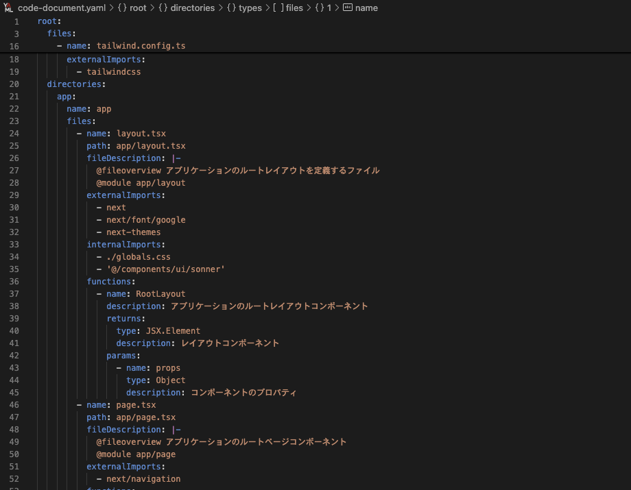
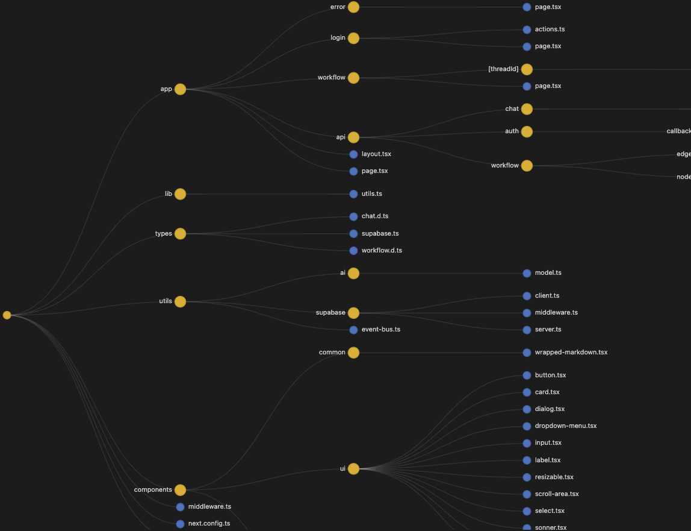

# Code is Document



「Code is Document」は、LLM ファーストの開発をサポートする VSCode 拡張機能です。  
コードをドキュメントとして扱うことで、人間と LLM の両者がメンテナンスし続けられるプロジェクトを目指します。

**基本思想**

拡張機能実行で作成される`code-document.yaml`にプロジェクトのコンテキストを詰め込みます。
このファイルを LLM に渡すことで、圧縮されたプロジェクトのコンテキストを理解させます。  
`code-document.yaml` に適切に情報を入れるために、コード内にコメントを記載することを忘れないでください。必要なコメントは、ファイル先頭に記載するコメント（`fileDescription`）とトップレベルの関数のコメント（`functions`）です。

YAML の構造について詳しくは[解析後 yaml ファイルの構造](#解析後-yaml-ファイルの構造)を参照してください。

**推奨事項**

cursor や windsurf の rules に「コードコメントを必ず含める」旨を追加することを推奨します。  
これにより、自動的にコメントが作成され、`code-document.yaml` に適切な情報が入ります。

## 機能

この拡張機能は以下の機能を提供します：

- **コード構造の解析**: プロジェクト内の TypeScript/JavaScript ファイル(ts, tsx, js, jsx)を解析し、構造情報を YAML ドキュメントとして出力します
- **構造の可視化**: 生成された YAML ドキュメントを使用して、インタラクティブな視覚的表現を提供します
- **関数情報の抽出**: JSDoc から関数の説明、パラメータ、戻り値情報を抽出します
- **依存関係の分析**: 内部・外部インポートを識別し、依存関係を明確にします



> ヒント: 大規模なプロジェクトでは、可視化によって依存関係の把握が格段に容易になります。

## 使用方法

1. コマンドパレットから `Create Document` を選択します
2. プロジェクトのルートディレクトリに `code-document.yaml` ファイルが生成されます
3. コマンドパレットから `Visualize Document` を選択します
4. 生成された `code-document.yaml` ファイルが D3.js を使用してウェブビューで表示されます

## 解析後 yaml ファイルの構造

`code-is-document` 拡張機能によって生成される YAML ファイル（`code-document.yaml`）は、プロジェクトのコード構造を階層的に表現しています。以下にその構造を詳しく説明します。

### 基本構造

```yaml
root:
  path: "/absolute/path/to/project"
  directories:
    # ディレクトリ階層
  files:
    # ルートディレクトリのファイル
```

### ディレクトリ構造

ディレクトリは階層的にネストされた形で表現されます：

```yaml
root:
  path: "/absolute/path/to/project"
  directories:
    src:
      directories:
        components:
          files:
            # componentsディレクトリのファイル
        utils:
          files:
            # utilsディレクトリのファイル
      files:
        # srcディレクトリのファイル
```

### ファイル情報

各ファイルは以下のような情報を含みます：

```yaml
- name: "example.ts" # ファイル名
  path: "src/example.ts" # ルートからの相対パス
  fileDescription: "ファイルの説明文" # ファイル先頭のコメント（存在する場合）
  externalImports: # 外部パッケージからのインポート
    - "react"
    - "lodash"
  internalImports: # プロジェクト内からのインポート
    - "./utils"
    - "@/components/Button"
  functions: # ファイル内の関数一覧
    - name: "calculateTotal"
      description: "合計を計算する関数"
      params: # パラメータ情報（JSDocから抽出）
        - name: "items"
          type: "Array<Item>"
          description: "計算対象のアイテム配列"
        - name: "tax"
          type: "number"
          description: "税率"
      returns: # 戻り値情報
        type: "number"
        description: "税込み合計金額"
```

#### ファイル情報

- **name**: ファイル名のみ（拡張子を含む）
- **path**: プロジェクトルートからの相対パス
- **fileDescription**: そのファイルの責務を記したコメント。ファイル先頭に記載されているコメントから抽出される（`use client`/`use server` は除外）

#### インポート情報

- **externalImports**: 外部パッケージからのインポート（`npm` パッケージなど）
  - 相対パスで始まらないインポート文が該当
  - 例: `import React from "react"`
- **internalImports**: プロジェクト内部のファイルからのインポート
  - 相対パス（`./`, `../`）または絶対パス（`/`, `@/`）で始まるインポートが該当
  - 例: `import { Button } from "./components/Button"`

#### 関数情報

JSDoc からコメント `@param`, `@returns` を抽出して関数情報を生成します。

- **name**: 関数名または変数名（アロー関数/関数式の場合）
- **description**: JSDoc から抽出された関数の説明
- **params**: 関数パラメータの情報
  - **name**: パラメータ名
  - **type**: パラメータの型（JSDoc の `@param {type}` から抽出）
  - **description**: パラメータの説明
- **returns**: 戻り値の情報
  - **type**: 戻り値の型（JSDoc の `@returns {type}` から抽出）
  - **description**: 戻り値の説明

### 解析ルール

- `.gitignore` のルールに従って、特定のファイルやディレクトリは解析から除外されます
- デフォルトで `node_modules`, `dist`, `out`, `build`, `.git` ディレクトリは除外されます
- 検索対象の拡張子は `.ts`, `.tsx`, `.js`, `.jsx` です

## 必要条件

この拡張機能を使用するには以下が必要です：

- Visual Studio Code 1.80.0 以上
- TypeScript/JavaScript プロジェクト

## 既知の問題

- 非常に大規模なプロジェクトでは、解析に時間がかかる場合があります
- 現在、TypeScript/JavaScript ファイルのみをサポートしています

## リリースノート

### 0.0.1

- 初期リリース
- コード構造の解析機能
- D3.js を使用した可視化機能
- JSDoc 解析サポート

---

## ライセンス

MIT
